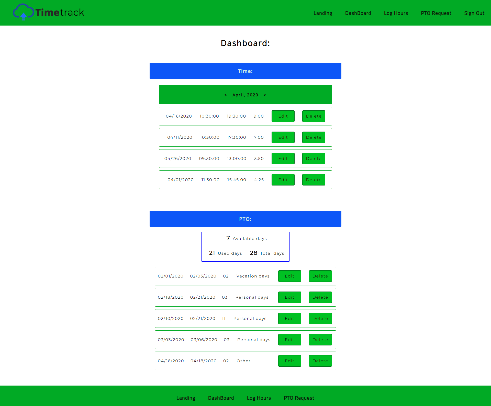
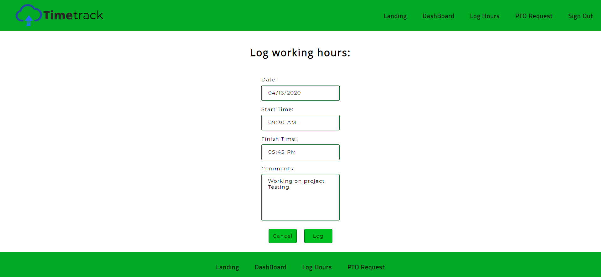

# Time Track

React client to fetch CRUD operations from server repo

## Description: 

Time track is a React application that allows users to log their daily working hours and Paid-Time-Off days to keep employee time records. The users can log the worked hours and requested PTO days, and they will safely be stored in the cloud.

## Technologies used: 

HTML, CSS, Javascript, React, React-Router, Fetch API

## Live Site

[Time Track](https://timetrack.now.sh/)

## Log in

To access the application it's neccesary to login with a user and password. Use the following:

username: michael@jones.com
password: michael

## Screenshots:

### Dashboard:

In the Dashboard the user can find all the information that is already logged in the application:

### Log Hours:

In the Log Hours page the user will be able to insert the employee time record:

### Request PTO:

In the Request PTO page users will be able to insert the Paid-Time-Off they request:

## Set up

Complete the following steps to start a new project (NEW-PROJECT-NAME):

1. Clone this repository to your local machine `git clone https://github.com/rodrigohervas/time-track-client.git NEW-PROJECT-NAME`
2. `cd` into the cloned repository
3. Make a fresh start of the git history for this project with `rm -r Force .git` and `git init`
4. Make sure that the .gitignore file is encoded as 'UTF-8'
5. Edit the contents of the `package.json` to use NEW-PROJECT-NAME instead of `"name": "time-track-client",`

## Related Repo:

[Time Track API](https://github.com/rodrigohervas/time-track-api)

## Scripts

Start the application `npm start`
